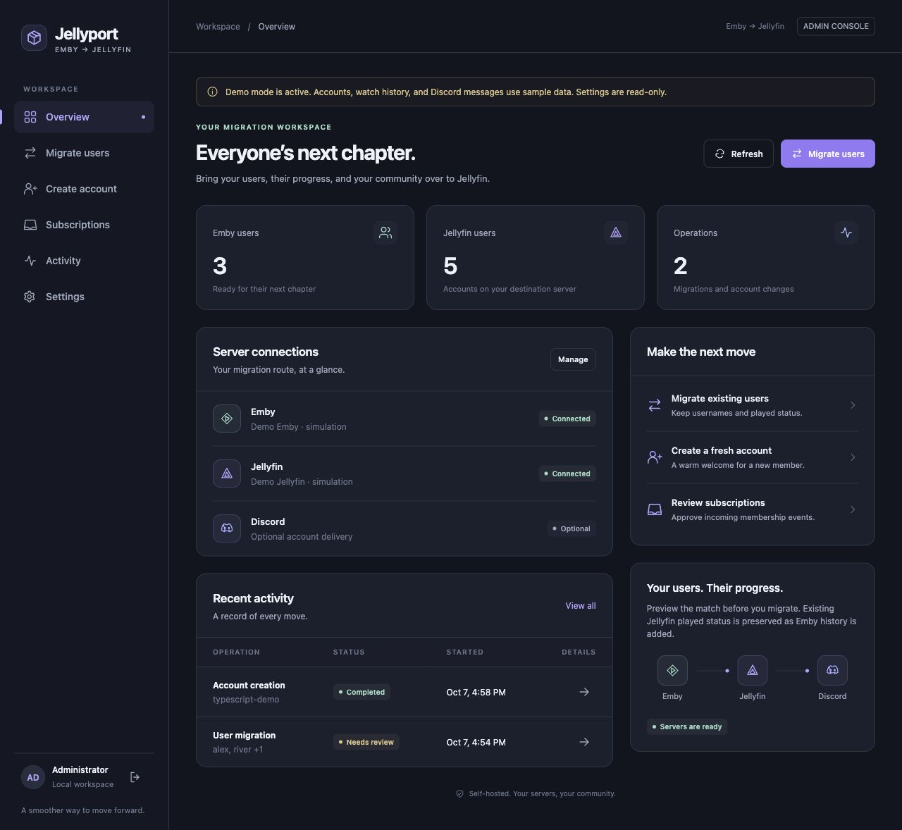

# Jellyport

Jellyport is a self-hosted web app for moving one or several users from Emby to Jellyfin, creating accounts from a Jellyfin template, and optionally delivering new credentials through Discord. It also provides an administrator review queue for MEE6 membership announcements and Discord membership role changes, with optional automatic provisioning and access removal.

The app uses TypeScript throughout: React/Vite for the web interface, Fastify on Node.js for the API, discord.js for the optional bot, and SQLite for encrypted settings, account links, audit records, and queued jobs. Docker packages the built interface and API together.

This is an initial implementation. Automated tests and the local demo cover the implemented workflows; compatibility has not yet been validated against your live Emby, Jellyfin, or Discord servers.



## Run with Docker Compose

### Portainer or a prebuilt image

The public image is `ghcr.io/cruv/jellyport:latest`, published for Linux x86-64 and ARM64 after the main branch passes CI. Portainer can pull it without GitHub credentials. Each publication also has a `sha-<full-commit-sha>` tag for selecting a commit; pin the image's manifest digest when you need an immutable deployment.

Paste [examples/compose.portainer.yaml](examples/compose.portainer.yaml) into Portainer's stack editor, or use this equivalent example:

```yaml
---
services:
  jellyport:
    image: ghcr.io/cruv/jellyport:latest
    container_name: jellyport
    user: "1000:1000" # Host UID:GID.
    environment:
      - JELLYPORT_DATA_DIR=/data
      - JELLYPORT_SECURE_COOKIE=false # Set true for HTTPS.
      - JELLYPORT_ALLOWED_HOSTS=${JELLYPORT_ALLOWED_HOSTS:-} # Optional proxy/custom DNS hostnames.
      - TZ=Etc/UTC # Optional.
    volumes:
      - "/path/to/jellyport:/data"
    ports:
      - "8000:8000"
    restart: unless-stopped
    stop_grace_period: 35s
    security_opt:
      - no-new-privileges:true
    cap_drop:
      - ALL
    read_only: true
    tmpfs:
      - /tmp:rw,noexec,nosuid,size=16m
    pids_limit: 128
```

Replace the host path and prepare that dedicated directory on your Docker host before deployment:

```sh
sudo install -d -m 700 -o 1000 -g 1000 /path/to/jellyport
```

`user: "1000:1000"` sets the real process UID and GID; change it and the directory owner together if your host uses different IDs. Jellyport does not use `PUID` or `PGID` environment variables.

Open `http://YOUR_LAN_IP:8000` or `http://localhost:8000` and complete the setup wizard with your Jellyfin server URL and an enabled Jellyfin administrator's username and nonempty password. Choose your existing template user and public Jellyfin URL. Subsequent sign-ins use your Jellyfin administrator account. Initial pairing requires both a private connection source and a local hostname or private IP address; complete it before exposing any reverse proxy. The first qualifying visitor can pair the installation.

For HTTPS through a reverse proxy, set `JELLYPORT_SECURE_COOKIE=true` and add its hostname to `JELLYPORT_ALLOWED_HOSTS`, for example `jellyport.example.com` (comma-separated hostnames, without schemes or ports). Preserve the browser's Host header. IP literals, single-label local names, and `.local`, `.localhost`, or `.home.arpa` names work by default. A public hostname cannot perform initial pairing. Use [examples/compose.shared-network.yaml](examples/compose.shared-network.yaml) when joining an existing media-server network from a separate stack; set `JELLYPORT_MEDIA_NETWORK` to the actual Docker network name. Jellyport connects through server APIs and only needs its own `/data` mount. It does not need access to media files or the Jellyfin configuration directory.

Use HTTPS or an encrypted VPN to protect administrator passwords and session cookies in transit. Review [the security assessment and deployment assumptions](docs/security-review.md) before exposing the administration interface.

For network details, updates, backups, and moving an existing named-volume deployment, see [Docker and Portainer deployment](docs/docker-deployment.md).

### Build from source

From a checkout of this repository:

```sh
cp .env.example .env
docker compose up -d --build
```

Open [http://127.0.0.1:8000](http://127.0.0.1:8000) and complete setup with your Jellyfin server URL and administrator account. Compose binds to `127.0.0.1:8000` by default; an SSH tunnel can provide localhost access from another machine during setup. After pairing, configure your HTTPS reverse proxy, set `JELLYPORT_SECURE_COOKIE=true` and `JELLYPORT_ALLOWED_HOSTS` in `.env`, then recreate the container. A proxy in another container needs a route to the host or an explicitly configured shared Docker network.

The container must be able to reach both media servers. A server URL containing `localhost` refers to the Jellyport container itself. Use reachable hostnames or addresses; reverse proxy base paths are supported.

Serve Jellyport at the root of its own host/subdomain. Run one application worker/replica: mutation coordination, the Discord Gateway connection, and admin sessions are local to that process. Account mutations are serialized, with the lock released between users in a bulk job so other account operations can run.

## Set up Jellyfin sign-in and your servers

The first-run wizard links Jellyport to one Jellyfin server. Enter the server URL and an enabled administrator's username and password. Jellyport verifies those credentials with Jellyfin and creates a dedicated API key for background account operations. It encrypts the key in its data directory and does not save your Jellyfin password.

Choose an existing, enabled Jellyfin template user that is not an administrator. New accounts receive its user policy and configuration, including library permissions. Set the public Jellyfin URL that users should receive in their credential message. After completing setup, configure the Emby source URL and API key in Settings.

After setup, sign in with the linked server's Jellyfin administrator username and password. Only enabled administrator accounts are accepted. Jellyport keeps each interactive Jellyfin token in server memory, checks the account's authorization on protected requests, and revokes that token on sign-out. The background API key is separate, so signing out does not interrupt queued work or the optional bot. Jellyfin sign-in requires the linked server to be reachable.

Settings keeps the sign-in server address fixed. If the background key is revoked, an authenticated administrator can refresh it from Settings. Refresh creates a new key while preserving the previous key for already queued jobs; remove obsolete Jellyport keys in Jellyfin's dashboard after those jobs finish. Use the [local authentication reset](docs/docker-deployment.md#reset-jellyfin-pairing) to recover access or update the linked server's address. Linking a different Jellyfin server requires a new Jellyport data directory, because existing account links and jobs belong to the original server.

Save your Emby settings and test the connections. The Emby key needs access to its users and their library data; Emby is used as a read-only source. Discord and all automatic actions are disabled by default; the web app can operate without a bot.

If the same media files have different mount paths on the two servers, configure source-to-target path prefix mappings. For example, the settings API accepts:

```json
{"path_mappings": [{"source": "/mnt/media", "target": "/media"}]}
```

API keys and the Discord bot token are encrypted in the application database. Leaving a saved editable secret's input blank preserves its current value.

## Migrate users

Select 1–100 distinct Emby users, review the preview, and start the migration. Usernames match exactly by default. Use **User mappings** for simplified usernames, different existing Jellyfin usernames, or other identity exceptions; case-only conflicts are never guessed.

Migration combines watched flags and favorites, preserves the larger play count and later playback date, and transfers resume positions when the source is demonstrably newer or Jellyfin has no competing progress. Existing Jellyfin progress wins when chronology is unknown or tied. Personal ratings and likes fill empty fields. Movies, episodes, music, books, photos, and identifiable containers are supported; aggregate season/series completion is derived from episode history instead of copied.

Matching uses provider IDs, series identity with season/episode numbers, and exact file paths with optional prefix mappings. It does not guess from titles. Conflicting metadata and duplicate editions are reported as ambiguous; missing matches are reported as unmatched. Those items are skipped and the job is marked partial so you can review them, correct metadata or mappings, and rerun the merge.

User-visible Emby playlists become **private copies owned by the destination user**, with matched entries in order. Existing Jellyfin playlists are preserved. Jellyfin 12 preserves repeated entries; 10.9–10.11 removes duplicates and the migration reports this. Creation sets privacy and all entries in one request. An encrypted import journal prevents blind replay after an uncertain response; later migrations never append to copies that their owners might have made public or shared.

New destination accounts receive a generated 24-character password and the template's permissions. Portable playback preferences and a bounded profile image can also transfer to new accounts. Existing accounts keep their passwords, permissions, preferences, and profile images. Administrators, disabled accounts, and the template user are protected from migration.

Jellyfin **10.9+** is required for detailed user data and explicit private playlists. Older versions receive a limited watched/favorite merge with warnings. Next Up and Continue Watching are rebuilt by Jellyfin from the migrated episode history, original dates, and resume positions; client cutoffs and unavailable media can affect their appearance. See [migration capabilities and limitations](docs/migration-capabilities.md) for everything supported, excluded, and reported.

### Map accounts with different usernames

1. Open **User mappings** and choose the source Emby account.
2. Select an existing enabled Jellyfin account, or enter the simplified username for a new account. Selecting an existing account preserves its username and password.
3. Optionally record a Discord username. To enable credential delivery and identity resolution, also provide the member's numeric Discord user ID with the bot connected. Jellyport verifies that ID against the configured Discord server.
4. Save, then review the migration preview. It shows the source and destination names and any verified Discord recipient.

Mappings are encrypted, scoped to the configured servers, and one-to-one. Queued work pins its mapping revision and refuses changed mappings. A created destination is pinned by Jellyfin ID so a replacement account cannot silently receive another user's data. Discord names alone are labels; verified IDs and durable account links drive automation. Saving a mapping does not itself change an account or send a message.

## Create accounts and deliver passwords

Use the account creation form for a new member. With a connected Discord bot, provide the member's numeric Discord user ID and their current Discord username. Jellyport uses the actual username (`member.user.username`), rather than a server nickname or display name.

For the first Discord link, the account's username must match the member's current Discord username exactly unless an administrator has saved a mapping with that verified Discord ID. For mapped existing Emby members, use migration (including `/jellyport migrate`) so their approved destination name and history are used. Jellyport does not guess ownership or rename accounts automatically.

When a recipient is selected, account provisioning stores the Discord user ID and Jellyfin account ID as a durable link. Membership actions use this link even if the member later changes their Discord username.

New passwords are encrypted and retained for up to 24 hours. After the job finishes, the web app offers a one-time reveal; revealing consumes the stored credential record. Successful Discord delivery removes that record immediately. If delivery fails, credentials remain available for the one-time reveal until expiration. Existing accounts have no new password to reveal or send.

Credential DMs contain the server URL, username, and plaintext password for the selected recipient. Command replies show only private job status. Users can change their password in Jellyfin after signing in.

If a creation times out or stops before initialization finishes, inspect Jellyfin and the recorded job before retrying. The recovery workflow first inspects an exact target account; recovery can reset its password and apply the template only when Jellyport tracks it as an incomplete creation. It preserves watched history and refuses protected or unrelated accounts.

## Optional Discord and membership automation

Follow [Discord setup](docs/discord-setup.md) to configure the bot, command permissions, trusted MEE6 announcement source, and optional membership role events.

```text
/jellyport create user:@jlogan35
/jellyport migrate user:@jlogan35 emby_username:jlogan35
/jellyport status job_id:YOUR_JOB_ID
```

Recognized events appear in the subscription review queue. Apply or ignore them as an administrator. An unresolved username remains for review and cannot automatically change an account; use a verified manual account action instead.

Automatic provisioning and automatic disabling are separate switches, both off by default. Provisioning uses an exact matching Emby account when available, otherwise creates a fresh Jellyfin account. An existing Jellyfin account without a Discord link requires an admin-approved migration before subscription automation can claim it.

Cancellation announcements default to review because cancellation can happen before paid access expires. Role removal or departure is treated as expiry; linked memberships are checked on startup/reconnect and every five minutes when role events are enabled. With automatic provisioning also enabled, reconciliation scans current active-role members for unlinked subscribers, including members who joined during downtime. Enabling this combination can provision all currently eligible unlinked members. Immediate disabling on cancellation is an explicit additional option. Jellyport has no direct MEE6 billing API integration or paid-through date tracking.

Lifecycle actions disable accounts rather than deleting them. Passwords and watched history are preserved. Returning members can regain access to accounts that Jellyport disabled; accounts disabled independently by an administrator are not automatically re-enabled.

## Data and backups

The repository's default `compose.yaml` stores application data in the `jellyport-data` named volume mounted at `/data`. The Portainer examples instead use your chosen host bind directory. Both contain `jellyport.db`, SQLite journal files when present, and `secret.key`. Server secrets and retained passwords are encrypted; audit records, usernames, account links, and job summaries are stored as ordinary database records. The encryption key is stored beside the database, so protect the entire volume or directory and its backups.

Stop the service before copying its data, and use a new destination directory for each backup:

```sh
docker compose stop jellyport
docker compose cp jellyport:/data ./jellyport-backup
docker compose start jellyport
```

Restore the database and `secret.key` together while the service is stopped. Without the original key, saved secrets cannot be decrypted. Keep the volume when rebuilding or upgrading. The saved Jellyfin pairing is part of this data directory.

New jobs persist their requests and an encrypted settings snapshot before execution. Jobs that have never started can resume after a restart. Running jobs are marked interrupted for review and are not silently replayed: a remote creation or policy change may already have succeeded. Rerunning a reviewed migration merges remaining data without resetting ordinary existing accounts.

### Upgrading from the Python version

Keep the same Compose project name, `jellyport-data` volume, and `.env`. Back up the stopped service as described above, pull the updated repository, then run `docker compose up -d --build`. The Node application reads the original SQLite schema and Fernet-encrypted records using the existing `secret.key`; no Python runtime or export/import step is required. It adds the queued-job table on startup. Old queued/running jobs lack a durable execution record and are marked interrupted for review. Settings, credentials within their retention period, account links, and audit history remain available.

Do not run both versions against the same volume. Keep your pre-upgrade backup if you need to roll back, and restore it while the service is stopped.

### Upgrading from shared-password sign-in

Keep the same data mount and back it up before updating the image. On the first visit after upgrading, complete the setup wizard with your Jellyfin administrator account. If a Jellyfin URL is already saved, the wizard keeps that server address fixed. Existing accounts, jobs, links, and settings remain in the data directory. Remove `JELLYPORT_ADMIN_PASSWORD` from your stack configuration if present; it is ignored. Installations already paired with Jellyfin continue using their normal Jellyfin sign-in.

## Development and local demo

Use Node.js 24 (recommended) or Node.js 22.13 or newer in the 22.x series. Dependencies are pinned in `package-lock.json`:

```sh
npm ci
npm run typecheck
npm test
npm run build
```

For real local operation, run:

```sh
HOST=127.0.0.1 npm start
```

Open the app and complete the setup wizard with your Jellyfin server URL and administrator account.

The demo uses simulated in-memory servers, makes no Emby/Jellyfin/Discord API calls, and keeps settings read-only. Use a separate data directory:

```sh
JELLYPORT_DEMO=true \
JELLYPORT_DATA_DIR=/tmp/jellyport-demo \
JELLYPORT_SECURE_COOKIE=false \
HOST=127.0.0.1 npm start
```

Sign in with username `admin` and password `demo-jellyport`. Demo server fixtures reset when the process restarts. Demo startup refuses a directory containing production settings, authentication, or user data.

For development with hot reload, run `npm run dev` for the API and `npm run dev:ui` in a second terminal. Open Vite's local URL at [http://127.0.0.1:5173](http://127.0.0.1:5173); it proxies `/api` to the Node service at port 8000. Production uses the compiled `dist/server` and `dist/client` files. Source lives in `server/` and `frontend/src/`; Vitest covers backend, Discord, persistence compatibility, and React safeguards. CI checks Node 22 and 24, the production build, dependency vulnerabilities, and a Docker demo smoke test.

## API

The browser uses authenticated session cookies. Mutating API requests require the session's `X-CSRF-Token`; get an anonymous session from `GET /api/session` before calling `POST /api/login` with a Jellyfin `username` and `password`. First-run setup uses the same CSRF protection and verifies a Jellyfin administrator account before pairing the server. Jellyfin access tokens and API keys are not returned to the browser. `/health` is unauthenticated. There is no public subscription webhook endpoint.

| Operation | Endpoint |
| --- | --- |
| Read or update configuration | `GET` / `PUT /api/settings` |
| Connect Jellyfin and complete first-run setup | `GET /api/setup`, `POST /api/setup/connect`, `POST /api/setup/complete` |
| Refresh the managed background API key | `POST /api/auth/service-key` |
| Test server connections | `POST /api/connections/test` |
| List source and destination users | `GET /api/users` |
| Preview or queue migrations | `POST /api/migrations/preview`, `POST /api/migrations` |
| Create a new account | `POST /api/accounts` |
| Inspect or recover an incomplete creation | `GET /api/accounts/recovery`, `POST /api/accounts/recover` |
| List or inspect jobs | `GET /api/jobs`, `GET /api/jobs/{job_id}` |
| Consume retained credentials | `POST /api/jobs/{job_id}/credentials` |
| Review, apply, or ignore membership events | `GET /api/subscriptions`, `POST /api/subscriptions/{event_id}/apply`, `POST /api/subscriptions/{event_id}/ignore` |

API contracts were checked against [Emby API-key authentication](https://dev.emby.media/doc/restapi/API-Key-Authentication.html), [Emby user items](https://dev.emby.media/reference/RestAPI/ItemsService/getUsersByUseridItems.html), and Jellyfin's [user controller](https://github.com/jellyfin/jellyfin/blob/master/Jellyfin.Api/Controllers/UserController.cs) and [playstate controller](https://github.com/jellyfin/jellyfin/blob/master/Jellyfin.Api/Controllers/PlaystateController.cs). Run a migration preview and test one account on your server versions before a bulk migration.
